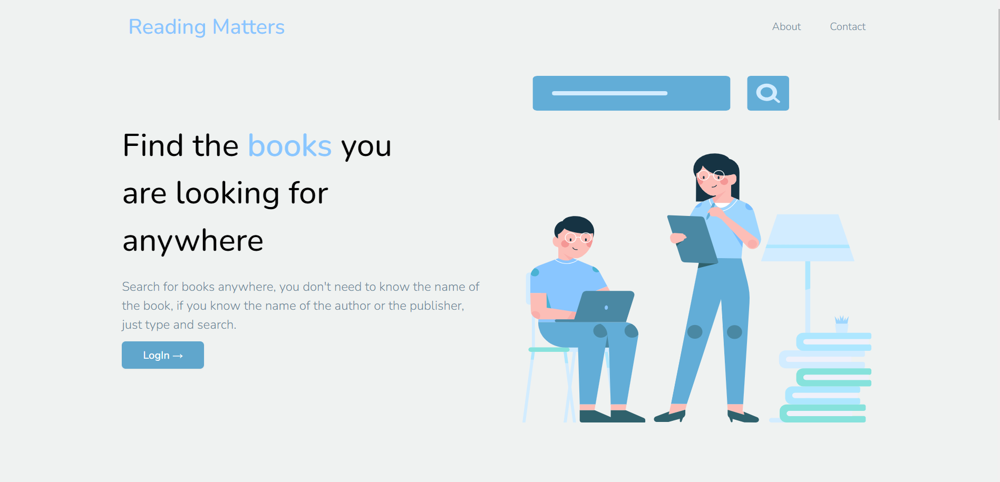
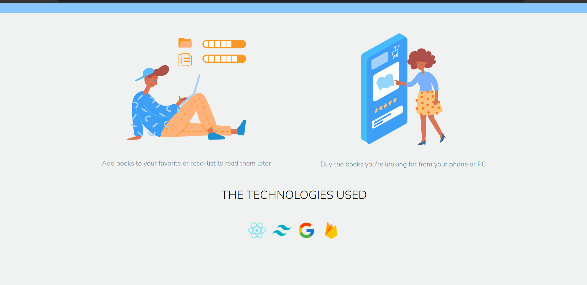
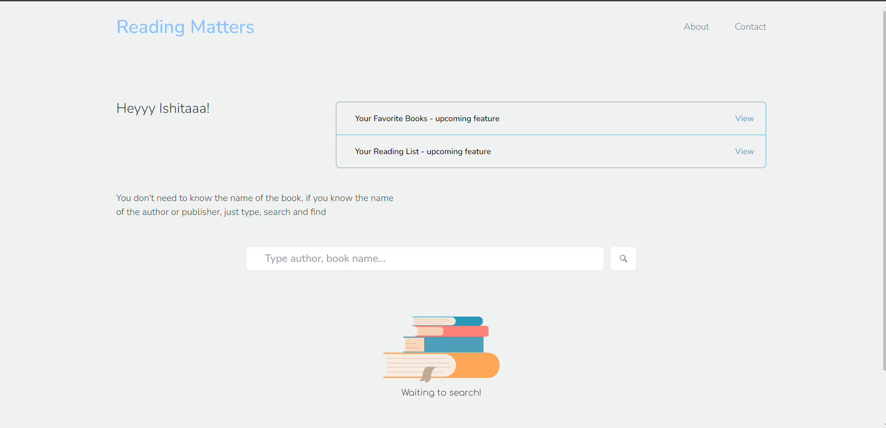
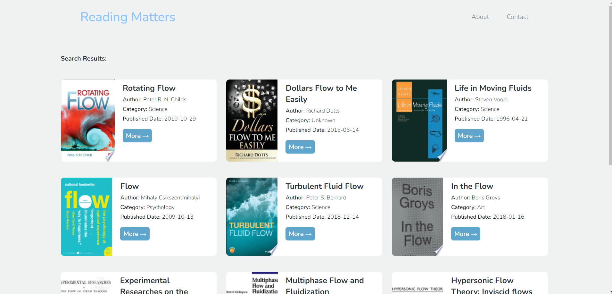

# Book Finder App

Welcome to the Book Finder App, your ultimate tool for discovering your next literary adventure! 📚🔍

## Table of Contents

- [About the App](#about-the-app)
- [Key Features](#key-features)
- [Technologies Used](#technologies-used)
- [Screenshots](#screenshots)
- [Getting Started](#getting-started)
- [How to Use](#how-to-use)
- [Contributing](#contributing)
- [License](#license)

## About the App

The Book Finder App is a delightful web application built with React, Tailwind CSS, Google Books API, and Firebase. Its primary goal is to make finding your next favorite book an enjoyable and easy experience. Whether you're a passionate bookworm or just looking for a good read, this app has got you covered!

## Key Features

- **Search Books**: Easily search for books using keywords, titles, authors, or ISBNs. The Google Books API ensures you get accurate and relevant results.

- **Book Details**: Get comprehensive information about a book, including its title, author, cover image, description, and more. Make informed decisions about your reading choices.

- **User-Friendly Interface**: The app features an intuitive and visually pleasing interface, designed with Tailwind CSS. Enjoy a smooth and engaging browsing experience.

- **Responsive Design**: Access the app from various devices, including desktops, tablets, and smartphones. The responsive design ensures a consistent experience across platforms.

## Technologies Used

- **React**: A popular JavaScript library for building user interfaces. It provides a dynamic and efficient way to create interactive components.

- **Tailwind CSS**: A utility-first CSS framework that makes styling and designing your app a breeze. Customize the app's appearance with ease.

- **Google Books API**: Utilize the power of Google's vast book database to retrieve accurate and up-to-date book information.

- **Firebase**: Google's platform for building web and mobile applications. We use Firebase Authentication for user management and Firestore for data storage.

## Screenshots

_Home Page - Search for your favorite books._

_Book Details - Get all the information you need about a book._

## Getting Started

1. Clone this repository: `git clone https://github.com/ishitaraina1807/Reading-Matters.git`
2. Navigate to the project directory: `cd Reading-Matters`
3. Install dependencies: `npm install`
4. Create a Firebase project and set up authentication and Firestore.
5. Obtain a Google Books API key from the [Google Cloud Console](https://console.cloud.google.com/).
6. Add your Firebase configuration and Google Books API key to the app.
7. Run the app: `npm start`

## How to Use

1. Open the app in your browser.
2. Use the search bar to look for books by entering keywords, titles, authors, or ISBNs.
3. Browse through the search results and click on a book to view its details.
4. If you want to save a book to your favorites, create an account or log in.
5. In the book details view, click the "Add to Favorites" button.

Happy reading with the Book Finder App! If you encounter any issues or have suggestions, feel free to open an issue or reach out to us. Enjoy exploring new literary worlds! 📖🌟
